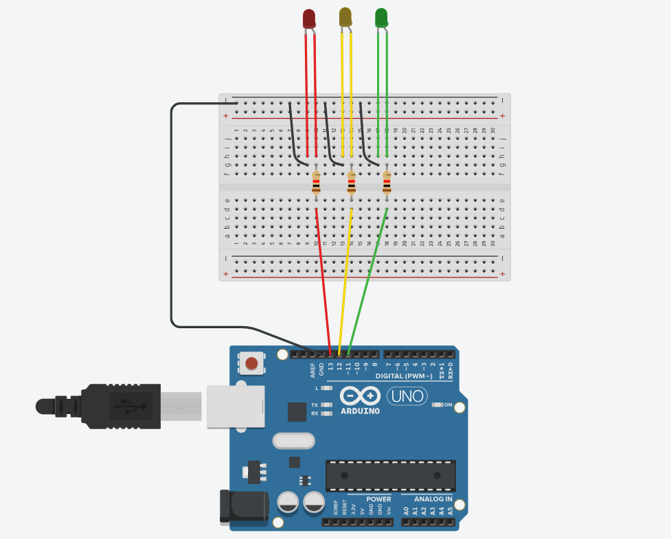

# Documentação do semáforo

## Lista de materiais 
&nbsp;&nbsp;&nbsp;&nbsp;Para o desenvolvimento e montagem do semáforo foram utilizados os seguintes itens:
- Placa Arduino UNO
- 3 LEDs
- 3 Resistores
- 7 Jumpers Macho-Macho
- 6 Jumpers Macho-Fêmea 

## Montagem
Para facilitar a explicação do modelo foi desenvolvida uma simulação, utilizando o software <a href="www.tinkercad.com" target="_blank">
Tinkercad</a>, similar ao projeto físico, como demonstrado abaixo:

  <figure>
    
    <figcaption>Clique <a href="https://www.tinkercad.com/things/4pz8TirhNPK-ingenious-juttuli?sharecode=TWBwF-pcTlXILWSPfLWoMtGtgypliw-Rq3ylfXNR4h4" target="_blank">aqui</a> para conferir a simulação.</figcaption>
  </figure>

&nbsp;&nbsp;&nbsp;&nbsp; Primeiramente, o _ground_ do Arduino foi conectado ao negativo da protoboard, estabelecendo a referência do terra para o circuito. Em seguida, cada cátodo dos LEDs foi conectado ao trilho negativo, compartilhando o mesmo _ground_. Os anodos dos LEDs foram conectados às portas digitais do Arduino por meio de resistores, para limitar a corrente e proteger os LEDs. Foram utilizados jumpers macho-macho para fazer as conexões e jumpers macho-fêmea para que os LEDs pudessem ser encaixados no semáforo. 